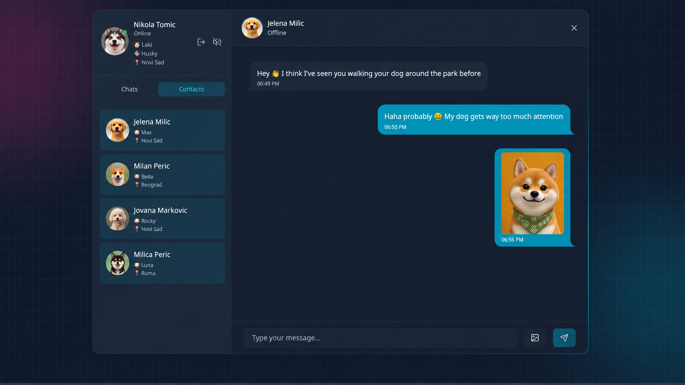
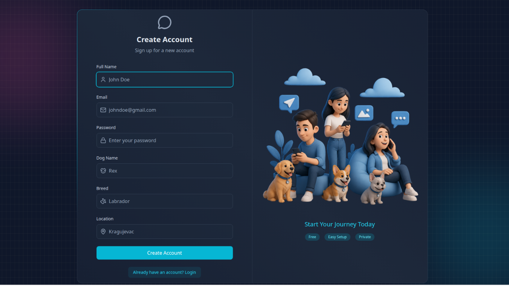
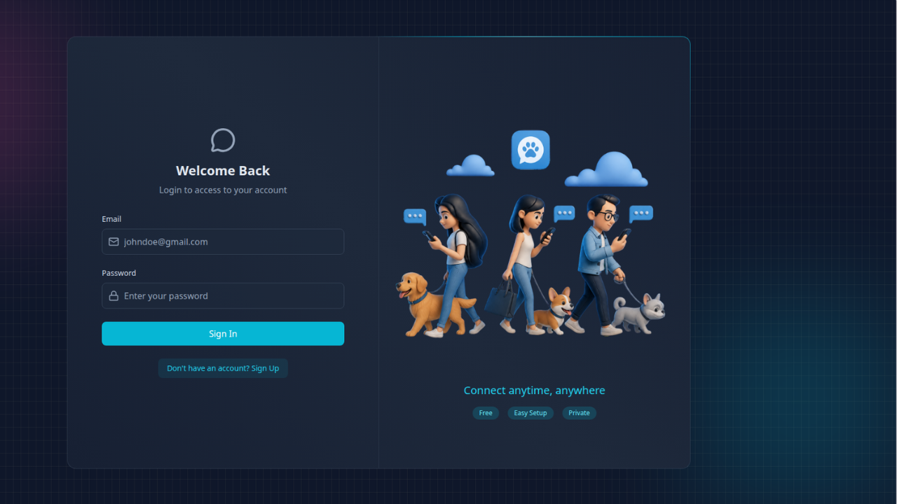

PawMeet – Real-Time Chat App for Dog Lovers 🐾

<p align="center">  </p>
🔥 Chat App – Key Features
🔐 Custom JWT Authentication (no third-party auth)
⚡ Real-time messaging with Socket.io
🟢 Online / offline user presence
🔔 Typing & notification sounds (toggleable)
🗂️ Image upload support (Cloudinary)
🧰 REST API built with Node.js & Express
🧱 MongoDB database for persistence
🚦 API rate limiting (Arcjet protection)
🎨 Modern UI with React, Tailwind CSS & DaisyUI
🧠 Zustand for lightweight state management

PawMeet is a full-stack real-time chat application designed for dog lovers to connect, chat, and share moments with their pets. Users can create accounts, upload profile pictures, see who is online, exchange instant messages, and share images in real time.
The project focuses on building a modern production-style MERN application with real-world features such as authentication, WebSocket communication, cloud image storage, API security, and responsive UI design.

<p align="center">  </p>

🛠️ Tech Stack
React.js
Tailwind CSS
Zustand
Node.js
Express.js
MongoDB
Socket.io
JWT AuthenticationCloudinary
Git & GitHub
Render Deployment

<p align="center">  </p>

PawMeet allows users to chat in real time, upload and share photos, send GIFs, discover nearby dog owners, and connect with people who share the same love for pets. The app combines modern social features with a clean and responsive user experience built for everyday use.

<p align="center">  </p>

---

## 🧪 .env Setup

### Backend (`/backend`)

```bash
PORT=3000
MONGO_URI=your_mongo_uri_here

NODE_ENV=development

JWT_SECRET=your_jwt_secret

RESEND_API_KEY=your_resend_api_key
EMAIL_FROM=your_email_from_address
EMAIL_FROM_NAME=your_email_from_name

CLIENT_URL=http://localhost:5173

CLOUDINARY_CLOUD_NAME=your_cloudinary_cloud_name
CLOUDINARY_API_KEY=your_cloudinary_api_key
CLOUDINARY_API_SECRET=your_cloudinary_api_secret

ARCJET_KEY=your_arcjet_key
ARCJET_ENV=development
```

---

## 🔧 Run the Backend

```bash
cd backend
npm install
npm run dev
```

## 💻 Run the Frontend

```bash
cd frontend
npm install
npm run dev
```
